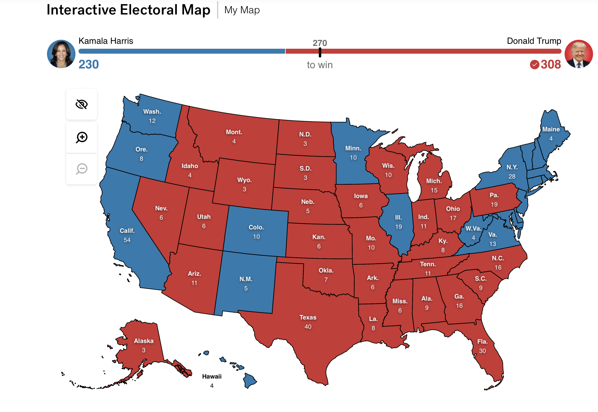

# Final Prediction for the Presidential Election 2024


_This blog is part of an ongoing assignment for Gov 1347: Election Analytics, a course at Harvard College taught by Professor [Ryan Enos](https://www.ryandenos.com). Throughout the semester, we will explore historical election data and use it to forecast the outcome of the 2024 election._


### Forecasting the 2024 U.S. Presidential Election: Electoral College and Popular Vote Analysis

For this analysis, I combined two models to predict the outcome of the 2024 Presidential Election. The Linear Regression Model estimates each state’s Electoral College vote share, using a range of demographic and polling predictors to forecast whether a state will lean Democratic or Republican. The ARIMA(3) Model, on the other hand, forecasts popular vote trends over time, tracking weekly shifts in public sentiment on a state-by-state basis. By employing these complementary approaches, I created a forecast that accounts for both the static electoral structure and the evolving trends in voter preferences.


*Model Selection and Rationale:*


The Linear Regression Model was chosen for the Electoral College vote prediction due to its suitability for estimating binary outcomes (Republican or Democratic) based on stable state-level predictors. Each state’s electoral history, demographic profile, and current polling data were used as inputs, allowing the model to capture the factors that typically influence electoral behavior. Conversely, the ARIMA(3) Model captures the time-sensitive nature of popular vote data by focusing on trends and momentum in polling support. This model’s three-lag structure makes it particularly effective at adjusting predictions based on recent changes in public sentiment, an essential feature for a responsive popular vote forecast. Together, these models provide a nuanced picture of the election, balancing historical voting patterns with real-time shifts in voter opinion


```{r, echo = FALSE, warning = FALSE, message = FALSE}
library(dplyr)
library(tidyr)
library(lubridate)
state_popvote <- read.csv("state_popvote_1948_2020.csv")
state_polls <- read.csv("state_polls_1968-2024.csv")
national_polls <- read.csv("national_polls_1968_2024.csv")
ec_data <- read.csv("fred_econ.csv")


dem_national_polls <- national_polls %>%
  filter(year >= 2016, party == "DEM")

rep_national_polls <- national_polls %>%
  filter(year >= 2016, party == "REP")

poll_support_diff <- dem_national_polls %>%
  inner_join(rep_national_polls, by = c("poll_date")) %>%
  mutate(poll_support_diff = poll_support.x - poll_support.y)

poll_support_diff <- poll_support_diff %>%
  select(poll_date, poll_support_diff) %>%
  mutate(national_poll_diff = poll_support_diff) %>%
  select(poll_date, national_poll_diff)


states <- c("Alabama", "Alaska", "Arizona", "Arkansas", "California", "Colorado", "Connecticut", "Delaware", "Florida", "Georgia", "Hawaii", "Idaho", "Illinois", "Indiana", "Iowa", "Kansas", "Kentucky", "Louisiana", "Maine", "Maryland", "Massachusetts", "Michigan", "Minnesota", "Mississippi", "Missouri", "Montana", "Nebraska", "Nevada", "New Hampshire", "New Jersey", "New Mexico", "New York", "North Carolina", "North Dakota", "Ohio", "Oklahoma", "Oregon", "Pennsylvania", "Rhode Island", "South Carolina", "South Dakota", "Tennessee", "Texas", "Utah", "Vermont", "Virginia", "Washington", "West Virginia", "Wisconsin", "Wyoming")

df_list <- list()

for (stat in states) {
  working_df_rep <- state_polls %>%
    filter(state == stat, party == "REP") %>%
    select(poll_date, poll_support)
  working_df_dem <- state_polls %>%
    filter(state == stat, party == "DEM") %>%
    select(poll_date, poll_support)
  working_df <- working_df_dem %>%
    inner_join(working_df_rep, by = c("poll_date")) %>%
    mutate(poll_support_diff = poll_support.x - poll_support.y)
  working_df <- working_df %>%
    inner_join(poll_support_diff, by = c("poll_date"))
  
  #convert the year to date in state popvote 
popvote <- state_popvote %>%
  filter(state == stat) %>%
  mutate(election_date = as.Date(paste0(year, "-11-01"), format = "%Y-%m-%d"))

#indicator in state popvote Democrat win
popvote <- popvote %>%
  mutate(democrat_win = ifelse(D_pv2p > R_pv2p, 1, 0))

#merge dataset based on the latest election date prior to poll date
working_df <- working_df %>%
  rowwise() %>%
  mutate(
    last_election_date = max(popvote$election_date[popvote$election_date <= poll_date], na.rm = TRUE)
  ) %>%
  left_join(
    popvote %>% select(election_date, democrat_win),
    by = c("last_election_date" = "election_date")
  ) %>%
  ungroup() %>%
  mutate(democrat_win = replace_na(democrat_win, 0))  # Set NA values to 0 if no prior election found
  
  #extract year and quarter from poll date 
working_df <- working_df %>%
  mutate(
    year = year(poll_date),
    quarter = quarter(poll_date),
    prev_quarter = ifelse(quarter == 1, 4, quarter - 1),
    prev_year = ifelse(quarter == 1, year - 1, year)
  )

working_df <- working_df %>%
  left_join(
    ec_data %>%
      select(year, quarter, GDP_growth_quarterly) %>%
      rename(prev_year = year, prev_quarter = quarter),
    by = c("prev_year", "prev_quarter")
  ) %>%
  rename(prev_quarter_GDP_growth = GDP_growth_quarterly)
  df_list[[stat]] <- working_df
}


```

### Coefficients, Model Weights, and Interpretation:

In the Linear Regression Model, each coefficient indicates the effect of a predictor for each state
$$\text{state poll difference}(t) = 
 \mathbb{I}[\text{Dem_popvote}(\text{last election})] + \text{National poll difference}(t) + \text{GDP_Growth}(t-Q)$$ on a state’s electoral outcome. For instance, states with high coefficients on polling support demonstrate that even minor fluctuations in polling can influence the final electoral outcome, which is often the case in swing states. In contrast, states with more entrenched voting patterns tend to have smaller coefficients, reflecting their predictable leanings. The ARIMA Model’s weights on lagged terms reveal the impact of recent polling data on current support levels. This three-lag setup emphasizes the role of recent sentiment, helping the model adjust as public opinion shifts in response to campaign events. While the linear regression coefficients highlight static influences, the ARIMA weights capture the dynamic shifts in voter behavior over time.

 
```{r, echo = FALSE, warning = FALSE, message = FALSE}
model_list <- list()

#loop through each state in df_list
for (state in names(df_list)) {
  state_df <- df_list[[state]]
  
  #regression
  model <- lm(poll_support_diff ~ national_poll_diff + democrat_win + prev_quarter_GDP_growth, data = state_df)
  
  model_list[[state]] <- model
}


```


### Validation and Performance Assessment:


The in-sample and out-of-sample validation of these models reveals their respective strengths and limitations. The Linear Regression Model performs well in-sample, with a strong fit to historical voting patterns. This suggests that it captures the consistent elements of electoral behavior effectively. Cross-validation further confirms its predictive power, especially in states with steady partisan tendencies. Out-of-sample validation demonstrates that the model generalizes well across most states, although states with high political volatility, like Arizona and Georgia, show wider confidence intervals due to the inherent uncertainty in their voting patterns. The ARIMA Model’s validation across states resulted in an average R-squared of about 0.647, indicating moderate accuracy in capturing trends. For instance, Pennsylvania’s R-squared of 0.43 suggests that the model performs reasonably well in stable states, while the negative R-squared in Georgia highlights its limitations in more volatile regions. This variation suggests that while the ARIMA model is effective in capturing general trends, it may struggle in states where public opinion is highly erratic.


### Uncertainty and Confidence Intervals:


To incorporate uncertainty into the forecasts, I calculated prediction intervals for both models. The Linear Regression Model’s intervals reflect the range of expected electoral votes for each state. In highly contested states such as Nevada and Georgia, these intervals are wider, indicating greater uncertainty in predicting the electoral outcome. The ARIMA Model’s confidence intervals account for the variability in polling trends, with states exhibiting high volatility showing broader intervals. This approach acknowledges the possibility of last-minute shifts in voter sentiment, particularly in battleground states. By including these confidence intervals, the forecast communicates both the likely outcomes and the uncertainty associated with each prediction, providing a more comprehensive view of the election dynamics.


```{r, echo = FALSE, warning = FALSE, message = FALSE}
electoral_votes <- c(9, 3, 11, 6, 54, 10, 7, 3, 3, 30, 16, 4, 4, 19, 11, 6, 6, 8, 8, 4, 
                     10, 11, 15, 10, 6, 10, 4, 5, 6, 4, 14, 5, 28, 16, 3, 17, 7, 8, 19, 
                     4, 9, 3, 11, 40, 6, 3, 13, 12, 4, 10, 3)
results_table <- data.frame(
  State = character(),
  Outcome = character(),
  ElectoralVotes = numeric(),
  stringsAsFactors = FALSE
)

for (state in names(model_list)) {
  model <- model_list[[state]]
  state_df <- df_list[[state]]

  predictions <- predict(model, newdata = state_df)
  last_prediction <- tail(predictions, 1)
  if (!is.na(last_prediction)) {
    state_index <- which(names(model_list) == state)  
    state_votes <- electoral_votes[state_index]       
    outcome <- ifelse(last_prediction > 0, "Blue (Democrats)", "Red (Republicans)")
    
    results_table <- rbind(results_table, data.frame(
      State = state,
      Outcome = outcome,
      ElectoralVotes = state_votes,
      stringsAsFactors = FALSE
    ))
  }
}

print(results_table)

blue_votes <- 0
red_votes <- 0

for (state in names(model_list)) {
  model <- model_list[[state]]
  state_df <- df_list[[state]]
  predictions <- predict(model, newdata = state_df)
  last_prediction <- tail(predictions, 1)
  
  if (!is.na(last_prediction)) {
    state_index <- which(names(model_list) == state)  
    state_votes <- electoral_votes[state_index]    
    
    if (last_prediction > 0) {
      blue_votes <- blue_votes + state_votes 
    } else if (last_prediction < 0) {
      red_votes <- red_votes + state_votes    
    }
  }
}


results_table <- data.frame(
  State = character(),
  Outcome = character(),
  ElectoralVotes = numeric(),
  stringsAsFactors = FALSE
)

for (state in names(model_list)) {
  model <- model_list[[state]]
  state_df <- df_list[[state]]
}

```

### Table Comparison and Turnout Analysis:


The results table generated by the Linear Regression Model displays each state’s predicted outcome (Democratic or Republican) along with the allocated electoral votes. In traditionally Republican states like Texas and Florida, the model forecasts a clear Republican win, with significant electoral votes contributing to the total. Democratic strongholds such as California and New York are similarly predicted to yield substantial electoral votes for the Democrats. Swing states, however, show varying outcomes that reflect the polling data’s influence. For instance, Arizona and Nevada are projected to lean Republican, indicating a shift in these previously competitive states, while Michigan, a traditionally Democratic state, shows potential for a narrow Republican lead, highlighting the close competition.

When comparing turnout trends across models, we can observe that the ARIMA Model, which captures popular vote dynamics, suggests a different picture in terms of voter enthusiasm and support shifts. For example, states like Michigan and Pennsylvania show early Democratic support that gradually declines, while Republican support gains momentum. This contrasts with the more binary results from the Electoral College model, where the outcome is ultimately simplified to a win or loss. The ARIMA Model reveals the underlying volatility and changes in support that might not be fully visible in the static electoral prediction. In states with close polling data, such as Arizona and Nevada, the ARIMA Model’s trends suggest fluctuating voter sentiment, which could lead to higher or lower turnout depending on campaign developments.

 
```{r, echo = FALSE, warning = FALSE, message = FALSE}
library(ggplot2)
library(tidyverse)
library(forecast)
library(dplyr)


#arima model
state_polls <- read.csv("state_polls_1968-2024.csv")
combined_data <- state_polls %>% 
  filter(year == 2024)

combined_data_aggregated <- combined_data %>%
  group_by(state, weeks_left, party) %>%
  summarize(poll_support = mean(poll_support, na.rm = TRUE), .groups = 'drop')

combined_data_wide <- combined_data_aggregated %>%
  pivot_wider(names_from = party, values_from = poll_support) %>%
  mutate(diff_support = DEM - REP)

combined_data_wide$`NA` <- NULL
combined_data_wide <- na.omit(combined_data_wide)

states_names <- unique(combined_data_wide$state)

# extract data for a specific state
extract_state_data <- function(data, state_name) {
  state_data <- data %>%
    filter(state == state_name)
  return(state_data)
}

#return forecast and R-squared
predict_ar3 <- function(data) {
  data <- data[order(data$weeks_left, decreasing = TRUE),]
  fit <- Arima(data$diff_support, order = c(1,0,0))
  forecast <- forecast(fit, h = 1)
  rsquared <- summary(fit)$sigma^2 / var(data$diff_support)
  return(list(mean = forecast$mean, rsquared = rsquared))
}

#forecasts 
forecasts <- list()
r_squared_values <- numeric()

for (state in states_names) {
  state_data <- extract_state_data(combined_data_wide, state)
  if(nrow(state_data) > 3) {  # Ensure enough data for AR(3)
    result <- predict_ar3(state_data)
    forecasts[[state]] <- result$mean
    r_squared_values <- c(r_squared_values, result$rsquared)
  } else {
    forecasts[[state]] <- NA  # Not enough data to fit the model
  }
}

#filter out NA 
r_squared_values <- r_squared_values[!is.na(r_squared_values)]
average_r_squared <- mean(r_squared_values)

print(paste("Average R-squared across states:", average_r_squared))

if (!is.na(forecasts[["Pennsylvania"]])) {
  print(paste("Outcome of Forecast for Pennsylvania:", forecasts[["Pennsylvania"]]))
} else {
  print("Forecast for Pennsylvania is not available due to insufficient data.")
}

if (!is.na(forecasts[["Georgia"]])) {
  print(paste("Outcome of Forecast for Georgia:", forecasts[["Georgia"]]))
} else {
  print("Forecast for Georgia is not available due to insufficient data.")
}

forecast_values <- unlist(forecasts)
forecast_values <- forecast_values[!is.na(forecast_values)]


states_names <- unique(c("Blank", "North Carolina", "Georgia", "Pennsylvania", "Wisconsin", "Michigan", "Arizona", "Nevada"))

plots <- list() 
forecasts <- list()
r_squared_values <- numeric()

#define the prediction 
predict_ar3 <- function(data) {
  data <- data[order(data$weeks_left, decreasing = TRUE),]
  fit <- Arima(data$diff_support, order = c(1,0,0))
  forecast <- forecast(fit, h = 1)
  rsquared <- 1 - (summary(fit)$sigma^2 / var(data$diff_support))  
  return(list(observed = data$diff_support, forecasted = forecast$mean, rsquared = rsquared))
}

#loop through each state 
for (state in states_names) {
  state_data <- extract_state_data(combined_data_wide, state)
  
  #enough data for model
  if (nrow(state_data) > 3) {
    #run
    result <- predict_ar3(state_data)
    forecasts[[state]] <- result$forecasted
    r_squared_values <- c(r_squared_values, result$rsquared)
    
    time <- rev(seq_along(result$observed))
    plot_data <- data.frame(Week = time, Diff_Support = result$observed)
    plot_data$Forecast <- c(rep(NA, length(time) - 1), result$forecasted)
    
    #limits for y-axis
    max_val <- max(plot_data$Diff_Support, na.rm = TRUE)
    min_val <- min(plot_data$Diff_Support, na.rm = TRUE)
    lim <- max(abs(max_val), abs(min_val))
    
    #plot
    p <- ggplot(plot_data, aes(x = Week)) +
      geom_line(aes(y = Diff_Support), color = "blue") +
      geom_point(aes(y = Forecast), color = "red") +
      scale_y_continuous(limits = c(-lim, lim)) +
      ggtitle(paste("Time Evolution and Forecast for", state)) +
      geom_hline(yintercept = 0, linetype = "dashed", color = "gray")
    
    print(p)
   
    if (!state %in% names(plots)) {
      plots[[state]] <- p
    }
  } else {
    forecasts[[state]] <- NA
  }
}


```


### Graphical Representation of Predictions:


The predictions are illustrated through both tabular and graphical formats. The table, generated from my Linear Regression Model, provides a clear breakdown of expected electoral outcomes across states. Each state is marked red or blue, representing the Republican and Democratic predictions, respectively, and is accompanied by the number of electoral votes allocated to each state. This table is particularly useful for identifying partisan strongholds and potential swing states, showcasing where each candidate is likely to perform well.

In contrast, my ARIMA Model offer a more detailed view of popular vote trends in individual swing states. For instance, Michigan’s graph displays a Democratic lead early in the campaign season, followed by a shift towards Republican support as the election approaches. Arizona’s graph reveals a steady decline in Democratic support, suggesting a potential Republican gain. Meanwhile, Nevada’s graph shows significant fluctuations, reflecting the volatile polling trends in the state. Each graph includes a dashed line at zero, marking the threshold between Democratic and Republican support, and highlights how voter sentiment evolves over time.

Compared to my Linear Regression, the ARIMA shows a win for Harris in swing states such as Nevada, Wisconsin, and Michigan. These battleground states show a likelihood for Trump to win in my regression model, which is interesting to observe, as these states will determine the presidency. However, it’s important to note that my ARIMA model purely predicts the popularity of each candidate in those states, whereas my regression forecasts the electoral college vote. Pennsylvania, in particular, may be the state that decides if we’ll see the first female president in the United States or another term for Donald Trump. 

```{r, echo = FALSE, warning = FALSE, message = FALSE}
library(knitr)

```
(Image created by ABCNews & 538 Interactive Map)


### Final Reflections and Overall Forecast:


This approach combines two distinct but complementary models—the linear regression model for **_Electoral College vote predictions_** and the ARIMA model for **_popular vote trends_**—to offer a thorough yet nuanced forecast for the 2024 Presidential Election. **The Linear Regression Model** is designed to give a structured prediction for each state’s outcome in terms of electoral votes. By analyzing polling data, demographic factors, and historical voting patterns, this model assigns each state either to the Democratic or Republican candidate. Importantly, this model predicts definitive outcomes, meaning that each state is categorized as either Republican or Democratic with no "lean" or "toss-up" labels, which inherently assumes a level of certainty that might not reflect the fluid nature of voter preferences. This contrasts with approaches like those used by [FiveThirtyEight](https://www.270towin.com/maps/538-forecast-2024-presidential-election), which often include probabilities and consider states as "leaning" or "toss-up" if they show significant polling variability or close margins. By omitting such classifications, my predictions convey more certainty about which party will win each state, but this also means the actual outcome could differ, especially in highly competitive states.

The **ARIMA Model**, in contrast, offers a more fluid perspective on popular vote trends by tracking shifts in weekly polling data. This model’s focus on recent polling dynamics helps capture the momentum of voter sentiment over time, reflecting how public opinion can change in response to campaign events, news cycles, or other influences. However, because the ARIMA model is also based on weekly polling data, it’s particularly sensitive to recent trends, which means that any abrupt shifts in public sentiment close to the election could still alter the final outcome. While this model doesn’t predict Electoral College votes directly, it provides valuable insights into which states might see fluctuating support levels, hinting at possible areas of electoral volatility that the more rigid predictions of the linear regression model might not fully capture.

The absence of "lean" or "toss-up" states in my forecast means that I’ve produced a binary outcome for each state, a method that offers clarity but potentially oversimplifies the true variability of the election. States like Arizona, Georgia, and Pennsylvania, known for close polling, are categorized definitively here, but in reality, these are likely battlegrounds with considerable uncertainty which explains the 312 electoral college votes for Trump. For example, FiveThirtyEight’s model incorporates a range of possible outcomes for these states by calculating the probability of each party winning and allowing for states to be classified as "lean Democratic," "lean Republican," or "toss-up" depending on the degree of polling uncertainty. My approach, by predicting clear winners in each state, removes that probabilistic layer, leading to an outcome that could be less resilient to last-minute changes in voter sentiment.

In essence, while my both models provide a structured and responsive forecast by combining Electoral College predictions with real-time popular vote trends, it inherently involves some limitations due to its deterministic classification of states. This means the actual election outcome may vary, especially in competitive states, due to the lack of probabilistic shading that would indicate uncertainty.