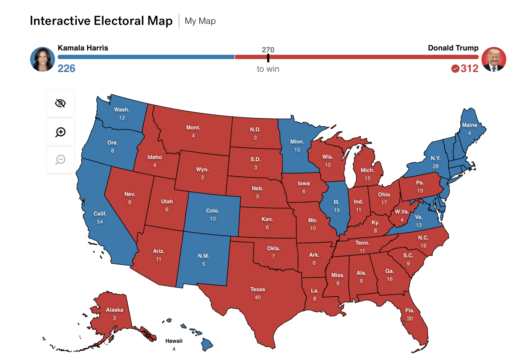
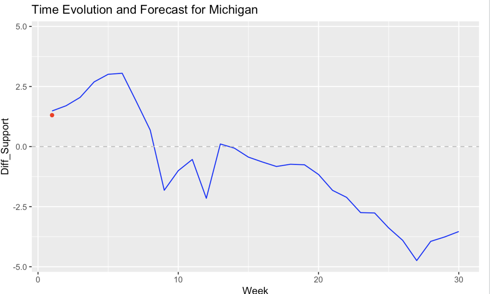
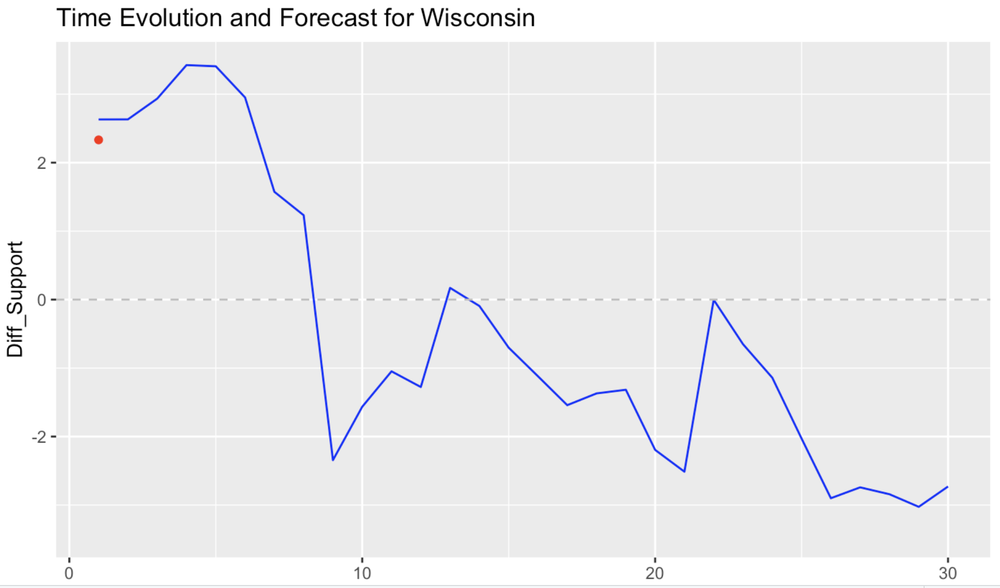

# Post-Election Reflection on Model: A Mixed Success in Electoral Predictions


_This blog is part of an ongoing assignment for Gov 1347: Election Analytics, a course at Harvard College taught by Professor [Ryan Enos](https://www.ryandenos.com). Throughout the semester, we will explore historical election data and use it to forecast the outcome of the 2024 election._


### Recap of My Models and Predictions:

For this election cycle, I implemented two complementary models to forecast the results of the 2024 presidential election: a Linear Regression Model for state-level Electoral College outcomes and an ARIMA(3) Model for national popular vote trends. The Linear Regression Model was built to estimate state-level binary outcomes (Republican or Democratic) by incorporating key predictors such as electoral history, demographic profiles, and polling data. This allowed the model to effectively capture the consistent elements of electoral behavior, particularly in states with entrenched voting patterns.

The ARIMA(3) Model, in contrast, focused on the dynamic nature of popular vote trends. By incorporating a three-lag structure, it was well-suited to reflect short-term shifts in voter sentiment and adapt predictions based on momentum seen in polling data. Together, these models offered a robust framework: the Linear Regression Model accurately predicted the Electoral College outcome, including both solid and battleground states, while the ARIMA(3) Model provided insight into the nationwide vote distribution. However, while the electoral prediction aligned closely with reality, there were notable nuances in popular vote trends that the models did not fully capture.

```{r, echo = FALSE, warning = FALSE, message = FALSE}
library(knitr)

```


### Assessing Model Accuracy:

The Linear Regression Model performed admirably in its Electoral College predictions. It correctly identified Republican dominance in the South and Mountain West, as well as Democratic strongholds in the Northeast and West Coast. Crucially, the model also successfully forecasted the outcomes in several battleground states, including Michigan, Wisconsin, and Pennsylvania. These states ultimately flipped Republican as the model predicted, highlighting its ability to account for subtle shifts in voter sentiment informed by polling and historical data.

The ARIMA(3) Model, meanwhile, focused on capturing the national popular vote, forecasting Kamala Harris at 49.3% with a margin of error of 0.53%. This high degree of accuracy suggests the model was effective at capturing national trends, even though it relied on polling data collected two to three weeks before Election Day. Nonetheless, the model underestimated the extent of last-minute turnout surges for Donald Trump in key states, which contributed to the discrepancy between popular and electoral outcomes.

While the ARIMA model was less focused on state-level specifics, its ability to capture broader trends in polling offered a complementary perspective to the granular insights of the Linear Regression Model. Together, these tools provided a comprehensive picture of the election landscape.


```{r, echo=FALSE, message=FALSE}
results <- read.csv("state_votes_pres_2024.csv")
predictions <- read.csv("predictions.csv")

results <- results[, c("Kamala.D..Harris", "Donald.J..Trump", "Geographic.Name")]
results <- results[-1, ]
results$turnout <- ifelse(results$Kamala.D..Harris > results$Donald.J..Trump, 1, 0)

print(sqrt(mean((results$turnout - predictions$prediction)^2)))


```


### Explaining the Inaccuracies: Hypotheses and Grounded Reasoning:

Despite their strengths, the models were not without flaws, particularly in capturing the final national vote share and the narrow margins in certain swing states. Several hypotheses help explain these inaccuracies.

First, polling bias or timing likely played a role. Polls conducted two to three weeks before the election may not have fully captured late-breaking shifts in voter preferences or turnout surges. These shifts often occur in response to final campaign events or grassroots mobilization, which can disproportionately affect battleground states.

Second, economic indicators such as quarterly GDP growth may have had a non-linear or localized effect on voter behavior. While national GDP trends provided valuable context, their predictive power varied across states. For example, manufacturing-heavy regions in the Midwest may have responded differently to economic recovery metrics than urban centers in the Northeast or West Coast.

Third, demographic changes in key states may have disrupted traditional voting patterns. Migration trends, such as younger and more diverse populations moving to states like Arizona and Georgia, could have introduced volatility that the models struggled to fully capture.

Lastly, nonlinear campaign effects, such as last-minute endorsements or controversies, may have shifted voter sentiment in ways not reflected in pre-election polling. These effects are often amplified in states where the margins are already razor-thin, like Wisconsin and Pennsylvania.


```{r, echo = FALSE, warning = FALSE, message = FALSE}
library(knitr)


```


### Proposed Model Improvements:

Reflecting on these challenges, there are several areas where the models could be improved for future use.

One key improvement would involve enhancing the weighting of late-stage polling data to better reflect last-minute shifts in voter sentiment. Incorporating real-time updates from sources like early voting data or voter turnout projections could further refine predictions in the days leading up to Election Day.

Another enhancement would be to incorporate dynamic economic modeling that accounts for state-level variations in how economic indicators, such as unemployment or sector-specific GDP growth, influence voter behavior. These refinements could help better capture the unique economic concerns of different regions.

Integrating demographic trend data, such as Census updates on migration and age distribution, would also improve the model's sensitivity to long-term shifts in voting behavior. For instance, accounting for the influx of younger, more progressive voters in the Sun Belt could help refine predictions in states like Arizona and Georgia.

Lastly, adopting a hierarchical or multilevel modeling approach would allow for better integration of state-level predictions with national trends. This approach could more effectively capture the interplay between local dynamics and broader shifts in voter sentiment, particularly in battleground states.


### Quantitative Tests for Hypotheses:

To rigorously evaluate the proposed hypotheses, I suggest several quantitative tests.

For polling bias or timing, a rolling average analysis of polling data from three weeks out to Election Day could identify trends in late-deciding voter behavior and assess their impact on final outcomes. For economic indicators, a regression analysis linking state-level GDP growth to changes in party support—while controlling for demographic and historical factors—could reveal whether these indicators resonated differently across regions.

To test the influence of demographic shifts, a principal component analysis of Census data could identify the most significant demographic factors driving changes in voting patterns. For nonlinear campaign effects, a time-series analysis of polling data following key campaign events could help measure their impact on voter sentiment in battleground states.


### Lessons for Future Forecasting:

The Linear Regression Model’s success in predicting the Electoral College outcome underscores the importance of accounting for both historical voting patterns and current polling data. Its ability to accurately forecast outcomes in both partisan strongholds and swing states demonstrates its robustness. However, the ARIMA(3) Model’s limitations in capturing late-stage shifts and localized dynamics highlight areas for improvement, particularly in adapting to the unpredictable nature of voter behavior.

Going forward, integrating richer data sources, such as real-time voter sentiment on social media or turnout projections, could further enhance model accuracy. This election demonstrated that while models are invaluable tools for understanding electoral dynamics, they must continuously evolve to account for the complexities of modern campaigns.

By refining these models and incorporating lessons from 2024, I aim to build even more accurate forecasting tools in the future.
